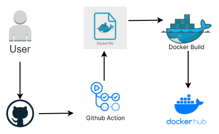

# Deploy Docker-hub with Github-Action

[](https://github.com/BagusArif9/simpleapp_node/actions)

Deskripsi singkat atau tujuan dari proyek Anda.

## GitHub Actions

Proyek ini menggunakan GitHub Actions untuk otomatisasi berbagai tugas. Workflow GitHub Actions yang digunakan adalah [Build and Push Docker Image](.github/workflows/main.yaml). 

Dokumentasi resmi GitHub Actions dapat ditemukan di [GitHub Actions Documentation](https://docs.github.com/en/actions).

## Docker

Proyek ini dikemas sebagai Docker image untuk kemudahan pengelolaan dan distribusi. Docker image dapat ditemukan di [Docker Hub](https://hub.docker.com/r/bagusarif/simpleapp_node).

### Instalasi

# Installation

1. Clone repository

```
git clone https://github.com/BagusArif9/simpleapp_node.git
```

2. Install dependencies

```
npm install
```

3. Build and run the project

```
node index.js

```

